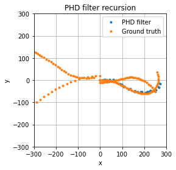

# Probability Hypothesis Density (PHD) filter

Python code for the Multi-Target Tracking (MTT) Probability Hypothesis Density (PHD) filtering recursion. A non-linear Gaussian motion model (coordinated turn) with constant probability of survival and a range/bearing measurement model are implemented. Part of the code has been adapted from the edX course "Multi-Object Tracking for Automotive Systems".



### Usage
Run ```main.py``` to perform the filtering recursion.

### Dependencies
* NumPy
* SciPy
* Matplotlib
* collections

### PHD filter

A PHD filter is a random finite set (RFS) approach to multi-target tracking where both states and measurements are immersed into sets of random length and values. Thus a Bayesian filtering recursion is performed on these sets in order to dynamically estimate the quantities of interest. A closed form of the filter recursion is obtained under the following assumptions:

* Both target motion model and measurement model are linear Gaussian, i.e.:


* The probabilities of survival and detection are constant.

* The birth intensity is a Gaussian mixture (GM) of the form:


#### Prediction

First, a prediction is done for the  birth targets. Existing targets generate  components in the GM with parameters:

![\begin{align*}
& i = 0 \\
& \textrm{for }  j = 1, \dots, J_{\gamma, k} \\
& \quad i := i +1 \\
& \quad w_{k|k-1}^{(i)} = w_{\gamma,k}^{j}, m_{k|k-1}^{(i)} = m_{\gamma|k}^{(j)}, P_{k|k-1}^{(i)}=P_{\gamma|k}^{(j)} \\
& \textrm{end} \\
& \textrm{for }  j = 1, \dots, J_{\beta, k} \\
& \quad \textrm{for }  j = 1, \dots, J_{k-1} \\
& \quad \quad i := i +1 \\
& \quad \quad w_{k|k-1}^{(i)} = w_{k-1}^{l} w_{\beta, k}^{j}, \\
& \quad \quad m_{k|k-1}^{(i)} = d_{\beta, k-1}^{(j)}+F_{\beta, k-1}^{(j)}m_{k-1}^{(l)}, \\
& \quad \quad P_{k|k-1}^{(i)} = Q_{\beta, k-1}^{(j)}+F_{\beta, k-1}^{(j)}P_{k-1}^{(l)}(F_{\beta, k-1}^{(j)})^{T}, \\
& \quad \textrm{end} \\
& \textrm{end} \\
& \textrm{for }  j = 1, \dots, J_{k-1} \\
& \quad i := i +1 \\
& \quad w_{k|k-1}^{(i)} = p_{S,k}w_{\k-1}^{(j)}, m_{k|k-1}^{(i)} = F_{k-1} m_{k-1}^{(j)}, P_{k|k-1}^{(i)}=Q_{k-1}+F_{k-1}P_{k-1}^{(j)}F_{k-1}^{T} \\
& \textrm{end} \\
& J_{k|k-1} = i
\end{align*}](https://render.githubusercontent.com/render/math?math=%5Cdisplaystyle+%5Cbegin%7Balign%2A%7D%0A%26+i+%3D+0+%5C%5C%0A%26+%5Ctextrm%7Bfor+%7D++j+%3D+1%2C+%5Cdots%2C+J_%7B%5Cgamma%2C+k%7D+%5C%5C%0A%26+%5Cquad+i+%3A%3D+i+%2B1+%5C%5C%0A%26+%5Cquad+w_%7Bk%7Ck-1%7D%5E%7B%28i%29%7D+%3D+w_%7B%5Cgamma%2Ck%7D%5E%7Bj%7D%2C+m_%7Bk%7Ck-1%7D%5E%7B%28i%29%7D+%3D+m_%7B%5Cgamma%7Ck%7D%5E%7B%28j%29%7D%2C+P_%7Bk%7Ck-1%7D%5E%7B%28i%29%7D%3DP_%7B%5Cgamma%7Ck%7D%5E%7B%28j%29%7D+%5C%5C%0A%26+%5Ctextrm%7Bend%7D+%5C%5C%0A%26+%5Ctextrm%7Bfor+%7D++j+%3D+1%2C+%5Cdots%2C+J_%7B%5Cbeta%2C+k%7D+%5C%5C%0A%26+%5Cquad+%5Ctextrm%7Bfor+%7D++j+%3D+1%2C+%5Cdots%2C+J_%7Bk-1%7D+%5C%5C%0A%26+%5Cquad+%5Cquad+i+%3A%3D+i+%2B1+%5C%5C%0A%26+%5Cquad+%5Cquad+w_%7Bk%7Ck-1%7D%5E%7B%28i%29%7D+%3D+w_%7Bk-1%7D%5E%7Bl%7D+w_%7B%5Cbeta%2C+k%7D%5E%7Bj%7D%2C+%5C%5C%0A%26+%5Cquad+%5Cquad+m_%7Bk%7Ck-1%7D%5E%7B%28i%29%7D+%3D+d_%7B%5Cbeta%2C+k-1%7D%5E%7B%28j%29%7D%2BF_%7B%5Cbeta%2C+k-1%7D%5E%7B%28j%29%7Dm_%7Bk-1%7D%5E%7B%28l%29%7D%2C+%5C%5C%0A%26+%5Cquad+%5Cquad+P_%7Bk%7Ck-1%7D%5E%7B%28i%29%7D+%3D+Q_%7B%5Cbeta%2C+k-1%7D%5E%7B%28j%29%7D%2BF_%7B%5Cbeta%2C+k-1%7D%5E%7B%28j%29%7DP_%7Bk-1%7D%5E%7B%28l%29%7D%28F_%7B%5Cbeta%2C+k-1%7D%5E%7B%28j%29%7D%29%5E%7BT%7D%2C+%5C%5C%0A%26+%5Cquad+%5Ctextrm%7Bend%7D+%5C%5C%0A%26+%5Ctextrm%7Bend%7D+%5C%5C%0A%26+%5Ctextrm%7Bfor+%7D++j+%3D+1%2C+%5Cdots%2C+J_%7Bk-1%7D+%5C%5C%0A%26+%5Cquad+i+%3A%3D+i+%2B1+%5C%5C%0A%26+%5Cquad+w_%7Bk%7Ck-1%7D%5E%7B%28i%29%7D+%3D+p_%7BS%2Ck%7Dw_%7B%5Ck-1%7D%5E%7B%28j%29%7D%2C+m_%7Bk%7Ck-1%7D%5E%7B%28i%29%7D+%3D+F_%7Bk-1%7D+m_%7Bk-1%7D%5E%7B%28j%29%7D%2C+P_%7Bk%7Ck-1%7D%5E%7B%28i%29%7D%3DQ_%7Bk-1%7D%2BF_%7Bk-1%7DP_%7Bk-1%7D%5E%7B%28j%29%7DF_%7Bk-1%7D%5E%7BT%7D+%5C%5C%0A%26+%5Ctextrm%7Bend%7D+%5C%5C%0A%26+J_%7Bk%7Ck-1%7D+%3D+i%0A%5Cend%7Balign%2A%7D)


#### Update

Similarly, a Kalman filter update is performed on the detected objects (i.e., for measurements associated to an existing target) with posterior parameters:

![\begin{align*}
& i = 0 \\
& \textrm{for }  j = 1, \dots, J_{\gamma, k} \\
& \quad i := i +1 \\
& \quad w_{k|k-1}^{(i)} = w_{\gamma,k}^{j}, m_{k|k-1}^{(i)} = m_{\gamma|k}^{(j)}, P_{k|k-1}^{(i)}=P_{\gamma|k}^{(j)} \\
& \textrm{end} \\
& \textrm{for }  j = 1, \dots, J_{\beta, k} \\
& \quad \textrm{for }  j = 1, \dots, J_{k-1} \\
& \quad \quad i := i +1 \\
& \quad \quad w_{k|k-1}^{(i)} = w_{k-1}^{l} w_{\beta, k}^{j}, \\
& \quad \quad m_{k|k-1}^{(i)} = d_{\beta, k-1}^{(j)}+F_{\beta, k-1}^{(j)}m_{k-1}^{(l)}, \\
& \quad \quad P_{k|k-1}^{(i)} = Q_{\beta, k-1}^{(j)}+F_{\beta, k-1}^{(j)}P_{k-1}^{(l)}(F_{\beta, k-1}^{(j)})^{T}, \\
& \quad \textrm{end} \\
& \textrm{end} \\
& \textrm{for }  j = 1, \dots, J_{k-1} \\
& \quad i := i +1 \\
& \quad w_{k|k-1}^{(i)} = p_{S,k}w_{\k-1}^{(j)}, m_{k|k-1}^{(i)} = F_{k-1} m_{k-1}^{(j)}, P_{k|k-1}^{(i)}=Q_{k-1}+F_{k-1}P_{k-1}^{(j)}F_{k-1}^{T} \\
& \textrm{end} \\
& J_{k|k-1} = i
\end{align*}](https://render.githubusercontent.com/render/math?math=%5Cdisplaystyle+%5Cbegin%7Balign%2A%7D%0A%26+i+%3D+0+%5C%5C%0A%26+%5Ctextrm%7Bfor+%7D++j+%3D+1%2C+%5Cdots%2C+J_%7B%5Cgamma%2C+k%7D+%5C%5C%0A%26+%5Cquad+i+%3A%3D+i+%2B1+%5C%5C%0A%26+%5Cquad+w_%7Bk%7Ck-1%7D%5E%7B%28i%29%7D+%3D+w_%7B%5Cgamma%2Ck%7D%5E%7Bj%7D%2C+m_%7Bk%7Ck-1%7D%5E%7B%28i%29%7D+%3D+m_%7B%5Cgamma%7Ck%7D%5E%7B%28j%29%7D%2C+P_%7Bk%7Ck-1%7D%5E%7B%28i%29%7D%3DP_%7B%5Cgamma%7Ck%7D%5E%7B%28j%29%7D+%5C%5C%0A%26+%5Ctextrm%7Bend%7D+%5C%5C%0A%26+%5Ctextrm%7Bfor+%7D++j+%3D+1%2C+%5Cdots%2C+J_%7B%5Cbeta%2C+k%7D+%5C%5C%0A%26+%5Cquad+%5Ctextrm%7Bfor+%7D++j+%3D+1%2C+%5Cdots%2C+J_%7Bk-1%7D+%5C%5C%0A%26+%5Cquad+%5Cquad+i+%3A%3D+i+%2B1+%5C%5C%0A%26+%5Cquad+%5Cquad+w_%7Bk%7Ck-1%7D%5E%7B%28i%29%7D+%3D+w_%7Bk-1%7D%5E%7Bl%7D+w_%7B%5Cbeta%2C+k%7D%5E%7Bj%7D%2C+%5C%5C%0A%26+%5Cquad+%5Cquad+m_%7Bk%7Ck-1%7D%5E%7B%28i%29%7D+%3D+d_%7B%5Cbeta%2C+k-1%7D%5E%7B%28j%29%7D%2BF_%7B%5Cbeta%2C+k-1%7D%5E%7B%28j%29%7Dm_%7Bk-1%7D%5E%7B%28l%29%7D%2C+%5C%5C%0A%26+%5Cquad+%5Cquad+P_%7Bk%7Ck-1%7D%5E%7B%28i%29%7D+%3D+Q_%7B%5Cbeta%2C+k-1%7D%5E%7B%28j%29%7D%2BF_%7B%5Cbeta%2C+k-1%7D%5E%7B%28j%29%7DP_%7Bk-1%7D%5E%7B%28l%29%7D%28F_%7B%5Cbeta%2C+k-1%7D%5E%7B%28j%29%7D%29%5E%7BT%7D%2C+%5C%5C%0A%26+%5Cquad+%5Ctextrm%7Bend%7D+%5C%5C%0A%26+%5Ctextrm%7Bend%7D+%5C%5C%0A%26+%5Ctextrm%7Bfor+%7D++j+%3D+1%2C+%5Cdots%2C+J_%7Bk-1%7D+%5C%5C%0A%26+%5Cquad+i+%3A%3D+i+%2B1+%5C%5C%0A%26+%5Cquad+w_%7Bk%7Ck-1%7D%5E%7B%28i%29%7D+%3D+p_%7BS%2Ck%7Dw_%7B%5Ck-1%7D%5E%7B%28j%29%7D%2C+m_%7Bk%7Ck-1%7D%5E%7B%28i%29%7D+%3D+F_%7Bk-1%7D+m_%7Bk-1%7D%5E%7B%28j%29%7D%2C+P_%7Bk%7Ck-1%7D%5E%7B%28i%29%7D%3DQ_%7Bk-1%7D%2BF_%7Bk-1%7DP_%7Bk-1%7D%5E%7B%28j%29%7DF_%7Bk-1%7D%5E%7BT%7D+%5C%5C%0A%26+%5Ctextrm%7Bend%7D+%5C%5C%0A%26+J_%7Bk%7Ck-1%7D+%3D+i%0A%5Cend%7Balign%2A%7D)

The weights must take into account clutter intensity by dividing them by the term 

---

## References
<a id="1">[1]</a>
Vo, B. N., & Ma, W. K. (2006). The Gaussian mixture probability hypothesis density filter. IEEE Transactions on signal processing, 54(11), 4091-4104.

Kudos to [https://tex-image-link-generator.herokuapp.com](https://tex-image-link-generator.herokuapp.com) for generating the links to the tex formulas.